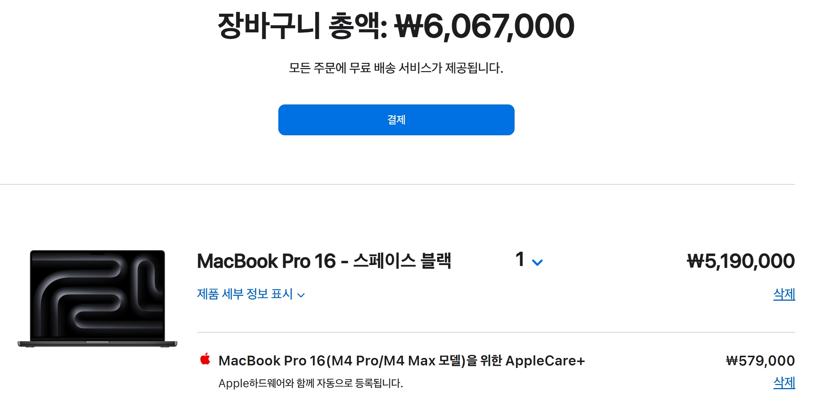
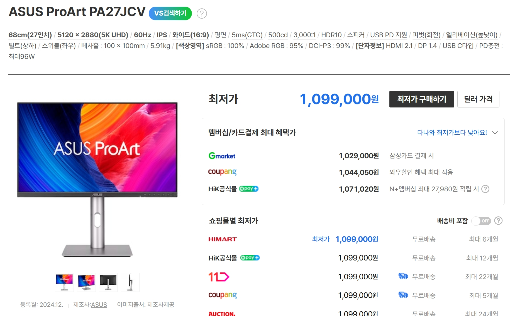

어떻게 부자가 되는건가는 우주 최고의 미스테리라고 해도 과언이 아니죠.

같이 한번 생각해 봅시다

보통 전통적으로 부를 쌓는 방법은 상거래와 무역이었다고 할수도 있겠죠. 아마 상인이 되는건 부자가 되기에 좋은 방법일 것입니다.

다들 아시잖아요 뭐 대항해시대라던가

기업가가 되는것도 부자가 되는 좋은 방법일 것입니다.

아니면 투자를 아주 잘할수도 있겠고요. 하지만 보통 99%의 사람들은 투자를 하면 망하죠

기업가가 된다고 하더라도 뭘 만들어 팔건데? 라는 고민을 하게 되죠

전세계 억만장자 순위를 보면 대부분이 기업가니 사업을 하는건 부자가 되기에 아주 좋은 방법이라고 할수있겠네요.

아니면 워렌버핏만큼 투자를 잘할수도 있구요

근데 워렌버핏도 기업을 소유하고 있으니 어떻게 보면 기업가라고 할수도 있는것 같습니다.

자 그러면 우리도 뭘 만들어 팔아야 할 것입니다. 근데 뭘 만들어 팔아야 할까요?

이 질문에 대한 답은 사실 생각보다 단순할 수 있습니다. 

**사람들이 진짜 필요로 하는 것을 만들어 팔면 됩니다.**

하지만 여기서 함정이 있죠. 사람들이 '원한다고 말하는 것'과 '실제로 돈을 내고 사는 것'은 완전히 다릅니다. 

예를 들어, 모든 사람이 "건강한 음식을 먹고 싶다"고 말하지만, 실제로는 맥도날드가 더 잘 팔리죠. 모든 사람이 "책을 더 읽고 싶다"고 말하지만, 실제로는 넷플릭스에 더 많은 시간을 씁니다.

그렇다면 정답은 무엇일까요?

**사람들이 실제로 시간과 돈을 쓰고 있는 곳을 관찰하는 것입니다.**

- 사람들이 어떤 앱을 매일 열어보는가?
- 사람들이 어떤 서비스에 매월 구독료를 내는가?  
- 사람들이 어떤 문제 때문에 밤잠을 설치는가?

결국 돈을 버는 것은 **문제 해결**입니다. 그리고 가장 큰 돈을 벌 수 있는 것은 **가장 많은 사람들이 겪고 있는 가장 큰 문제를 해결**하는 것이죠.

물론 이게 말처럼 쉽지는 않습니다. 하지만 적어도 방향은 맞다고 생각합니다.

아마 사람들은 뭔가 바라는게 있을것입니다.
사람들이 바라는걸 주고 거기에 대한 대가로 돈을 받을수 있겠죠..

아마 사람들은 돈을 바랄겁니다. 돈은 모든것과 바꿀수있는 궁극의... 그 머냐... 암튼 궁극적인 뭔가니까요.
근데 그렇다고 해서 사람들에게 돈을 주는걸 비즈니스 모델로 할수는 없죠 당연히

그러면 이렇게 생각을 해 봅시다... 사람들은 돈을 가지고 뭘 하고싶어하는가? 뭘 사고싶어하는가?
그리고 사람들이 또 돈만을 원하는건 아니죠. 뭐 건강이라던가... 우정이라던가... 평판이나 명예라던가... 인정이라던가... 가족이나 사랑이라던가...
물론 이것들이 돈과 관계가 있는건 사실이지만...

그니까 사람들이 원하는걸 사람들에게 주거나, 사람들이 싫어하는걸 사람들의 삶에서 없애주거나, 그런식으로 비즈니스를 하는걸 생각해볼수 있겠죠.

더 에센스만 뽑아내서 말하자면, 좋은걸 주거나, 나쁜걸 없애주거나 하는거죠.

근데 그래서 구체적으로 뭘할건데? 라고 물으면 그걸 정하기는 쉽지않죠..

원리 8: 한 나라의 생활 수준은 그 나라의 생산 능력에 달려 있다.
쉽게 말해: 국민이 잘 사는 나라는 천연자원이 많은 나라가 아니라, **'생산성(한 사람이 일정 시간에 만들어내는 가치)'** 이 높은 나라입니다.

부자 되기 Tip: 개인에게도 똑같이 적용됩니다. 당신의 소득 수준은 궁극적으로 당신의 '생산성(능력, 기술, 지식)'에 의해 결정됩니다. 몸값을 높이려면 자신의 생산성을 높여야 합니다.

근데 저는 돈을 얼마를 벌고싶은걸까요

그냥 막연히 많으면 많을수록 좋은걸까요

그래도 한번 숫자를 정해보는게 도움이 될지도 모르겠군요

한 500억 정도는 있었으면 좋겠군요

500억을 버는거는 확실히 쉬운일이아니죠

그렇다고 해서 불가능한것도 아니죠 저한테 주어진 시간이 무한하고 제 의지가 이어진다면 언젠가는 목표를 달성하긴 할것같네요

그러면 가장 작은것부터 시작해 보는게 좋을것같네요 뭐든지 작은것부터 시작해서 큰게 되니까요

근데 뭘 하면 좋을까요 제가 좋아하고 재미를 느낄수 있을만한걸 하면서 돈을벌수있다면 좋을것같군요

근데 아무튼 수줍음이 적은 성격이 부자가 되기 좋은것같네요 왜냐하면 뭔가를 팔려면 사람들을 만나거나 사람들 앞에 서거나 해야하는데 부끄러움을 많이타서 그런걸 못해버리면 큰일이니까요

---

## 부자가 되는 두 가지 길: 사업과 투자

어떻게 하면 부자가 될 수 있을까요? 이는 많은 사람들의 오랜 질문입니다. 전통적으로 부를 쌓는 길은 크게 두 가지로 나뉩니다.

1.  **기업가(사업가)가 되는 길:** 역사적으로 상거래와 무역을 통해 부를 쌓았듯, 현대에도 무언가를 만들어 파는 '사업'은 부를 이루는 가장 확실한 방법 중 하나입니다. 전 세계 억만장자 순위를 보면 대부분이 기업가 출신이라는 점이 이를 증명합니다.
2.  **위대한 투자자가 되는 길:** 워렌 버핏처럼 뛰어난 안목으로 투자를 하는 방법도 있습니다. 하지만 99%의 사람들에게 투자는 부를 쌓는 길이 아니라 잃는 길이 되기 쉽습니다. 흥미롭게도, 워렌 버핏 역시 기업을 소유하고 운영한다는 점에서 넓은 의미의 기업가로 볼 수 있습니다.

결국, 부의 길은 '기업가 정신'으로 수렴하는 경향이 있습니다.

## 핵심 질문: 무엇을 만들어 팔 것인가?

그렇다면 기업가로서, 우리는 무엇을 만들어 팔아야 할까요?

답은 의외로 간단하게 들릴 수 있습니다. **사람들이 진짜 필요로 하는 것을 만들어 파는 것.**

하지만 여기에는 중요한 함정이 있습니다. 사람들은 종종 '자신이 원한다고 말하는 것'과 '실제로 돈을 쓰는 것' 사이에서 다른 선택을 합니다.

> "건강한 음식을 먹고 싶다"고 말하지만, 실제로는 패스트푸드를 소비합니다.  
> "책을 더 읽고 싶다"고 말하지만, 실제로는 넷플릭스를 시청합니다.

따라서 진짜 기회는 사람들의 말이 아닌 행동에 있습니다. 정답은 **사람들이 실제로 시간과 돈을 쓰고 있는 곳을 관찰하는 것**입니다.

*   사람들이 어떤 앱을 매일 열어보는가?
*   사람들이 어떤 서비스에 매월 구독료를 내는가?
*   사람들이 어떤 문제 때문에 밤잠을 설치는가?

## 돈의 본질: 문제 해결과 생산성

사람들의 행동을 관찰하면 돈의 본질에 가까워질 수 있습니다. 돈을 번다는 것은 결국 **가치 있는 문제 해결**에 대한 보상입니다.

*   **좋은 것을 제공하기:** 사람들이 원하는 것(즐거움, 편리함, 건강, 인정, 사랑)을 줍니다.
*   **나쁜 것을 제거하기:** 사람들이 피하고 싶어하는 것(불편함, 고통, 불안, 시간 낭비)을 없애줍니다.

가장 큰돈을 버는 길은 **가장 많은 사람들이 겪는 가장 큰 문제를 해결**하는 것입니다.

이는 경제학의 기본 원리와도 통합니다. 맨큐의 경제학 원론 8원칙은 다음과 같습니다.

> **한 나라의 생활 수준은 그 나라의 생산 능력에 달려 있다.**

국민이 잘 사는 나라는 자원이 많은 나라가 아니라, **생산성(한 사람이 일정 시간에 만들어내는 가치)**이 높은 나라입니다.

이 원칙은 개인에게도 그대로 적용됩니다. 당신의 소득 수준은 당신의 '생산성'에 의해 결정됩니다. 몸값을 높이려면, 남들이 풀지 못하는 문제를 해결할 수 있는 능력, 즉 자신의 생산성을 높여야 합니다.

## 그래서, 나는 무엇부터 해야 할까?

이러한 원칙들을 제 자신에게 적용해 봅니다.

"나는 돈을 얼마나 벌고 싶은가?"

막연히 '많으면 많을수록 좋다'고 생각하기보다, 구체적인 목표를 세워보는 것이 도움이 될 겁니다. 예를 들어 '500억'이라는 목표를 세워봅니다. 물론 쉬운 일은 아니지만, 올바른 방향으로 꾸준히 나아간다면 불가능한 목표도 아닐 것입니다.

모든 위대한 여정은 작은 첫걸음에서 시작됩니다. 지금 당장 할 수 있는 것은 무엇일까요?

1.  **내가 좋아하고 잘할 수 있는 분야 찾기:** 지속 가능한 노력을 위해서는 재미와 흥미가 필수적입니다.
2.  **그 분야에서 사람들이 겪는 문제 관찰하기:** 내가 해결할 수 있는 작은 문제부터 찾아봅니다.
3.  **두려움 극복하기:** 무언가를 만들고 판다는 것은 결국 사람들과의 소통입니다. 부끄러움을 극복하고 자신을 드러내는 용기가 필요할 것입니다.

결국 '어떻게 부자가 될 것인가'라는 질문은 **'나는 세상에 어떤 가치를 제공할 것인가'** 라는 질문으로 귀결됩니다. 그 답을 찾아가는 여정 자체가 의미 있는 삶이 아닐까 생각합니다.

---

컴퓨터 용량이 꽉차서 더이상 뭘 할수가 없습니다

어떻게든 새 컴퓨터를 사야합니다...

720만원을 모아야 합니다...

하...... 어떡하면좋을까요...

알바천국을 둘러보고 있습니다...

일하기가 너무싫어요...

어째서 나는 이런 현실에 처해버린거지...

정말 알수없습니다...

상태창을 외치고싶은 기분이군요

저도 일론머스크처럼 세상을 꿈이라고 생각해버릴까요

근데 그렇게 한다고 해도 별로 바뀌는건 없더라구요

just one manic episode라는 농담이 있었죠

ㅋㅋㅋㅋㅋㅋㅋㅋㅋㅋㅋㅋㅋㅋㅋㅋㅋ

별로 좋은 생각은 아닌것같군요