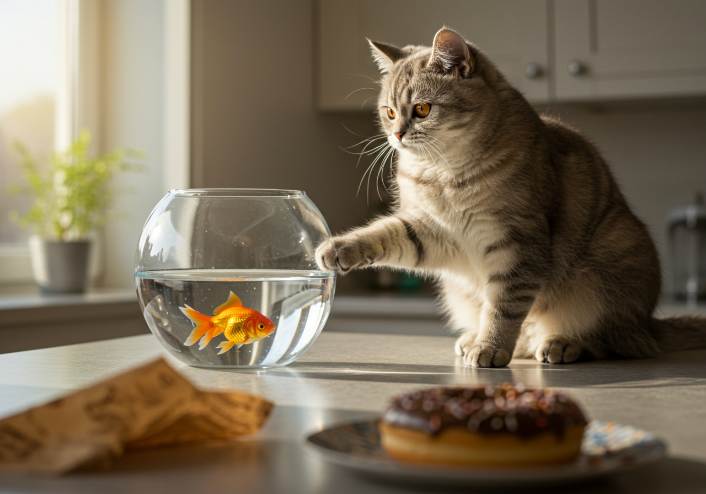

옛날 옛적에, 아주 호기심 많고 장난기 넘치는 고양이 한 마리가 있었어요. 이름은 '냥이'였죠. 냥이는 매일 새로운 모험을 찾아 집안을 돌아다녔어요.

어느 날, 냥이는 부엌 싱크대 위에서 반짝이는 무언가를 발견했어요. 그것은 바로 금붕어 어항이었죠! 냥이는 어항 속에서 헤엄치는 금붕어들을 보며 눈을 반짝였어요. '저 작은 물고기들은 과연 어떤 맛일까?' 냥이는 생각했어요.

냥이는 조심스럽게 앞발을 어항 속으로 넣어보았어요. 첨벙! 금붕어들은 깜짝 놀라 이리저리 도망쳤죠. 냥이는 물속에서 발을 빼고는, 축축한 발을 털며 생각했어요. '흠, 생각보다 재미없네. 물고기 잡는 건 영 내 취향이 아니군.'

그때, 거실에서 달콤한 냄새가 풍겨왔어요. 냥이는 즉시 부엌을 벗어나 냄새의 근원지를 찾아 나섰어요. 거실 바닥에는 주인이 방금 떨어뜨린 초콜릿 도넛이 놓여 있었죠! 냥이는 도넛을 보자마자 눈이 휘둥그레졌어요.

냥이는 도넛에 코를 킁킁거렸어요. '이게 대체 뭘까? 이렇게 달콤한 냄새는 처음 맡아봐!' 냥이는 도넛을 한입 물고 싶었지만, 문득 주인이 초콜릿은 고양이에게 좋지 않다고 말했던 것이 떠올랐어요. 냥이는 잠시 망설이다가 도넛을 그대로 두고 주인의 무릎 위로 뛰어올라 골골송을 불렀어요.

주인은 냥이를 쓰다듬으며 웃었어요. "우리 냥이, 오늘 착한 일 했네?" 냥이는 주인의 따뜻한 손길을 느끼며 만족스럽게 낮잠을 자기 시작했어요. 비록 금붕어도 못 잡고, 초콜릿 도넛도 못 먹었지만, 냥이는 오늘 하루도 충분히 재미있는 모험을 했다고 생각했답니다.

